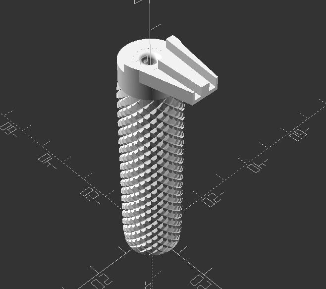
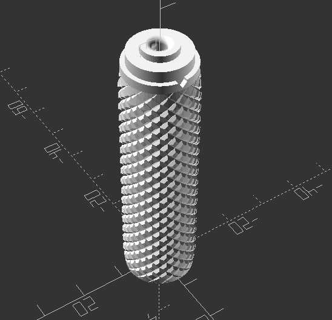
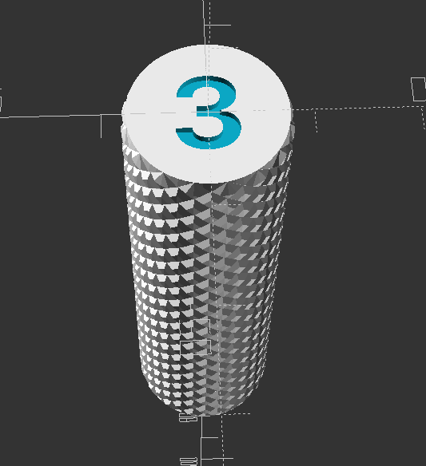
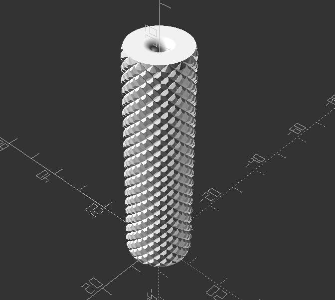

# A 3D Printed Coil Tool
This repository will contain the OpenSCAD files as well as STL/AMF exports of the parts needed to actually print the tool yourself.

You will need [BOSL2](https://github.com/revarbat/BOSL2/) and [KnurledFinishLib](https://www.thingiverse.com/thing:9095) and of course [OpenSCAD](https://openscad.org/) to be able to render and export the file in OpenSCAD.

You can adjust the size of the coil rod by changing the **c_id** value and you can adjust the tolerance with the **c_id_t** value. This will over or undersize the coil rod hole to compensate for shrinkage from printing.

It will automatically change the text on the bottom ( If you have a half size, e.g. 2.5mm, you may need to reduce the font size )

You can also adjust the depth of the text, or the font by changing the **size_text** module.

The knurling is also completely adjustable with the following parameters.

- knurl_wd      - Knurl polyhedron width
- knurl_hg      - Knurl polyhedron height
- knurl_dp      - Knurl polyhedron depth
- e_smooth      - Cylinder ends smoothed height
- s_smooth      - [ 0% - 100% ] Knurled surface smoothing amount

It was designed for [these rods](https://www.amazon.com/DYWISHKEY-Stainless-Assortment-Diameter-1-0-8-0mm/dp/B09W5PBHGR/), but anything could be used. 

- [The Main Tool Body with Wrapping Cap](Coil_Rod_Handle_w_Cap.scad)
- [The Main Tool Body without Cap](Coil_Rod_Handle.scad)

You will need to adjust any parameters you want then render and export to STL for slicing and printing.

